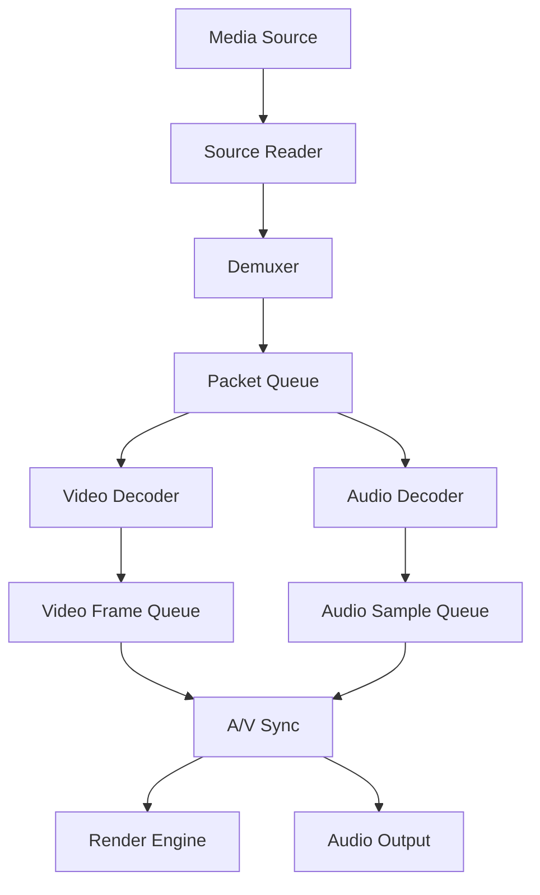

# Media Engine Component Specification
## CortenBrowser Project - Component Version 1.0

### Table of Contents
1. [Component Overview](#component-overview)
2. [Technical Requirements](#technical-requirements)
3. [Interface Specification](#interface-specification)
4. [Internal Architecture](#internal-architecture)
5. [Implementation Strategy](#implementation-strategy)
6. [External Dependencies](#external-dependencies)
7. [Build Configuration](#build-configuration)
8. [Test Strategy](#test-strategy)
9. [Development Milestones](#development-milestones)
10. [Performance Requirements](#performance-requirements)
11. [Security Considerations](#security-considerations)

## Component Overview

### Purpose and Responsibilities
The Media Engine is responsible for all audio and video playback capabilities in the CortenBrowser. It handles media format detection, demuxing, decoding, synchronization, and rendering of audio/video content from various sources including HTML5 media elements, WebRTC streams, and Media Source Extensions (MSE).

### Core Responsibilities
- **Media Format Support**: Support for common web media formats (MP4, WebM, Ogg, MP3, AAC, etc.)
- **Codec Management**: Hardware and software codec selection and fallback
- **Stream Processing**: Demuxing, decoding, and synchronization of audio/video streams
- **Playback Control**: Play, pause, seek, rate control, volume management
- **Resource Management**: Memory buffering, cache management, and resource cleanup
- **DRM Support**: Content Decryption Module (CDM) interface for protected content
- **WebRTC Media**: Real-time media encoding/decoding for WebRTC
- **Media Capture**: Screen, camera, and microphone capture APIs

### Current Implementation Status
- **Phase 1**: GStreamer with gstreamer-rs bindings
- **Phase 2**: Hybrid approach with Rust decoders for common formats
- **Phase 3**: Full Rust implementation with hardware acceleration

### Component Boundaries
- **Inputs**: Network streams, file buffers, WebRTC streams
- **Outputs**: Decoded video frames (RGB/YUV), PCM audio samples
- **Dependencies**: Network Stack for streaming media
- **Consumers**: Render Engine (video frames), Audio subsystem (audio samples)

## Technical Requirements

### Media Format Support Matrix

| Container | Video Codecs | Audio Codecs | Priority | Implementation |
|-----------|-------------|--------------|----------|----------------|
| MP4 | H.264, H.265, AV1 | AAC, MP3, Opus | Critical | Phase 1 |
| WebM | VP8, VP9, AV1 | Vorbis, Opus | Critical | Phase 1 |
| Ogg | Theora | Vorbis, Opus | High | Phase 1 |
| MKV | H.264, VP9, AV1 | AAC, Vorbis | Medium | Phase 2 |
| MPEG-TS | H.264, H.265 | AAC, MP3 | Medium | Phase 2 |
| FLV | H.264 | AAC, MP3 | Low | Phase 3 |

### Codec Support Requirements

#### Video Decoders
```rust
pub enum VideoCodec {
    H264 {
        profile: H264Profile,
        level: H264Level,
        hardware_accel: bool,
    },
    H265 {
        profile: H265Profile,
        tier: H265Tier,
        level: H265Level,
    },
    VP8,
    VP9 {
        profile: VP9Profile,
    },
    AV1 {
        profile: AV1Profile,
        level: AV1Level,
    },
    Theora,
}
```

#### Audio Decoders
```rust
pub enum AudioCodec {
    AAC {
        profile: AACProfile,
        sample_rate: u32,
        channels: u8,
    },
    MP3 {
        layer: MP3Layer,
        bitrate: u32,
    },
    Opus {
        sample_rate: u32,
        channels: u8,
        application: OpusApplication,
    },
    Vorbis,
    FLAC,
    PCM {
        format: PCMFormat,
        sample_rate: u32,
        channels: u8,
    },
}
```

### Performance Requirements
- 4K@60fps playback with <5% CPU on hardware decode
- 1080p@30fps software decode with <30% CPU (single core)
- Audio/video sync within ±40ms
- Seek latency <100ms for local content
- Startup time <500ms for first frame
- Memory usage <500MB for 4K playback

## Interface Specification

### Public API Definition

```rust
use std::sync::Arc;
use tokio::sync::mpsc;

/// Main Media Engine interface
pub trait MediaEngine: Send + Sync {
    /// Initialize a new media session
    async fn create_session(&self, config: MediaSessionConfig) -> Result<SessionId, MediaError>;
    
    /// Load media from a source
    async fn load_source(&self, session: SessionId, source: MediaSource) -> Result<(), MediaError>;
    
    /// Control playback
    async fn play(&self, session: SessionId) -> Result<(), MediaError>;
    async fn pause(&self, session: SessionId) -> Result<(), MediaError>;
    async fn seek(&self, session: SessionId, position: Duration) -> Result<(), MediaError>;
    async fn set_playback_rate(&self, session: SessionId, rate: f32) -> Result<(), MediaError>;
    
    /// Audio control
    async fn set_volume(&self, session: SessionId, volume: f32) -> Result<(), MediaError>;
    async fn set_muted(&self, session: SessionId, muted: bool) -> Result<(), MediaError>;
    
    /// Get media information
    async fn get_duration(&self, session: SessionId) -> Result<Duration, MediaError>;
    async fn get_current_time(&self, session: SessionId) -> Result<Duration, MediaError>;
    async fn get_buffered_ranges(&self, session: SessionId) -> Result<Vec<TimeRange>, MediaError>;
    
    /// Frame/sample extraction
    async fn get_video_frame(&self, session: SessionId) -> Result<VideoFrame, MediaError>;
    async fn get_audio_samples(&self, session: SessionId, count: usize) -> Result<AudioBuffer, MediaError>;
    
    /// Cleanup
    async fn destroy_session(&self, session: SessionId) -> Result<(), MediaError>;
}

/// Media source types
pub enum MediaSource {
    /// URL to media file
    Url(String),
    
    /// Raw bytes buffer
    Buffer {
        data: Vec<u8>,
        mime_type: String,
    },
    
    /// Streaming source with chunks
    Stream {
        receiver: mpsc::Receiver<MediaChunk>,
        mime_type: String,
    },
    
    /// Media Source Extensions
    MSE {
        source_buffers: Vec<SourceBuffer>,
    },
    
    /// WebRTC media stream
    WebRTC {
        peer_connection: Arc<PeerConnection>,
        track_id: String,
    },
    
    /// Device capture
    Capture {
        device: CaptureDevice,
        constraints: MediaConstraints,
    },
}

/// Video frame representation
pub struct VideoFrame {
    pub width: u32,
    pub height: u32,
    pub format: PixelFormat,
    pub data: Vec<u8>,
    pub timestamp: Duration,
    pub duration: Option<Duration>,
    pub metadata: FrameMetadata,
}

/// Audio buffer representation
pub struct AudioBuffer {
    pub format: AudioFormat,
    pub sample_rate: u32,
    pub channels: u8,
    pub samples: Vec<f32>,
    pub timestamp: Duration,
    pub duration: Duration,
}
```

### Message Bus Integration

```rust
/// Messages the Media Engine handles
pub enum MediaEngineMessage {
    // From Browser Shell
    CreateMediaElement { 
        element_id: String,
        attributes: MediaElementAttributes,
    },
    
    // From Network Stack
    StreamData {
        session_id: SessionId,
        chunk: MediaChunk,
    },
    
    // From DOM/JavaScript
    PlaybackCommand {
        session_id: SessionId,
        command: PlaybackCommand,
    },
    
    // From WebRTC
    AddRemoteStream {
        peer_id: String,
        stream: MediaStream,
    },
}

/// Messages the Media Engine emits
pub enum MediaEngineEvent {
    // To Render Engine
    VideoFrameReady {
        session_id: SessionId,
        frame: VideoFrame,
    },
    
    // To Audio subsystem
    AudioSamplesReady {
        session_id: SessionId,
        buffer: AudioBuffer,
    },
    
    // To DOM/JavaScript
    PlaybackStateChanged {
        session_id: SessionId,
        state: PlaybackState,
    },
    
    MediaError {
        session_id: SessionId,
        error: MediaError,
    },
    
    // Progress events
    BufferingProgress {
        session_id: SessionId,
        buffered_percentage: f32,
    },
}
```

## Internal Architecture

### Module Structure

```
media-engine/
├── src/
│   ├── lib.rs                 # Public API
│   ├── engine.rs              # Core engine implementation
│   ├── session.rs             # Media session management
│   ├── pipeline/
│   │   ├── mod.rs            # Pipeline orchestration
│   │   ├── source.rs         # Source readers
│   │   ├── demuxer.rs        # Container demuxing
│   │   ├── decoder.rs        # Codec abstraction
│   │   └── sync.rs           # A/V synchronization
│   ├── formats/
│   │   ├── mod.rs
│   │   ├── mp4.rs            # MP4 container parser
│   │   ├── webm.rs           # WebM container parser
│   │   ├── ogg.rs            # Ogg container parser
│   │   └── matroska.rs       # Matroska/MKV parser
│   ├── codecs/
│   │   ├── mod.rs
│   │   ├── video/
│   │   │   ├── h264.rs       # H.264 decoder
│   │   │   ├── h265.rs       # H.265 decoder
│   │   │   ├── vp8.rs        # VP8 decoder
│   │   │   ├── vp9.rs        # VP9 decoder
│   │   │   └── av1.rs        # AV1 decoder
│   │   └── audio/
│   │       ├── aac.rs        # AAC decoder
│   │       ├── mp3.rs        # MP3 decoder
│   │       ├── opus.rs       # Opus decoder
│   │       └── vorbis.rs     # Vorbis decoder
│   ├── hardware/
│   │   ├── mod.rs
│   │   ├── vaapi.rs          # Linux hardware acceleration
│   │   ├── dxva.rs           # Windows hardware acceleration
│   │   └── videotoolbox.rs  # macOS hardware acceleration
│   ├── drm/
│   │   ├── mod.rs
│   │   ├── cdm.rs            # CDM interface
│   │   └── eme.rs            # Encrypted Media Extensions
│   ├── webrtc/
│   │   ├── mod.rs
│   │   ├── encoder.rs        # WebRTC encoders
│   │   └── rtp.rs            # RTP packetization
│   ├── capture/
│   │   ├── mod.rs
│   │   ├── screen.rs         # Screen capture
│   │   ├── camera.rs         # Camera capture
│   │   └── microphone.rs     # Audio capture
│   ├── buffer/
│   │   ├── mod.rs
│   │   ├── ring.rs           # Ring buffer for streaming
│   │   └── cache.rs          # Frame cache
│   └── utils/
│       ├── mod.rs
│       ├── time.rs           # Timestamp utilities
│       └── metrics.rs        # Performance metrics
```

### Data Flow Architecture



### State Management

```rust
/// Media session state machine
pub struct MediaSession {
    id: SessionId,
    state: Arc<RwLock<SessionState>>,
    pipeline: Arc<MediaPipeline>,
    metrics: Arc<Metrics>,
}

pub enum SessionState {
    Idle,
    Loading {
        source: MediaSource,
        progress: f32,
    },
    Ready {
        duration: Duration,
        metadata: MediaMetadata,
    },
    Playing {
        position: Duration,
        rate: f32,
    },
    Paused {
        position: Duration,
    },
    Seeking {
        target: Duration,
    },
    Ended,
    Error(MediaError),
}

/// Pipeline components
pub struct MediaPipeline {
    source_reader: Box<dyn SourceReader>,
    demuxer: Box<dyn Demuxer>,
    video_decoder: Option<Box<dyn VideoDecoder>>,
    audio_decoder: Option<Box<dyn AudioDecoder>>,
    sync_controller: AVSyncController,
    buffer_manager: BufferManager,
}
```

### Thread Model

```rust
/// Threading architecture
pub struct MediaEngineThreads {
    /// Main control thread - handles API calls
    control_thread: JoinHandle<()>,
    
    /// Demuxer thread - reads and parses containers
    demuxer_thread: JoinHandle<()>,
    
    /// Video decode thread pool
    video_decode_pool: ThreadPool,
    
    /// Audio decode thread
    audio_decode_thread: JoinHandle<()>,
    
    /// Network I/O thread for streaming
    network_thread: Option<JoinHandle<()>>,
    
    /// Hardware decode thread (if applicable)
    hw_decode_thread: Option<JoinHandle<()>>,
}

/// Thread communication
pub struct ThreadChannels {
    /// Control -> Pipeline commands
    command_tx: mpsc::Sender<PipelineCommand>,
    
    /// Pipeline -> Control events
    event_tx: mpsc::Sender<MediaEvent>,
    
    /// Demuxer -> Decoders packets
    video_packet_tx: mpsc::Sender<VideoPacket>,
    audio_packet_tx: mpsc::Sender<AudioPacket>,
    
    /// Decoders -> Sync frames/samples
    video_frame_tx: mpsc::Sender<VideoFrame>,
    audio_sample_tx: mpsc::Sender<AudioBuffer>,
}
```

## Implementation Strategy

### Phase 1: GStreamer Integration (Weeks 1-2)
Implement full media playback using GStreamer bindings.

```rust
// Phase 1: GStreamer-based implementation
use gstreamer as gst;
use gstreamer_app as gst_app;

pub struct GStreamerMediaEngine {
    pipeline: gst::Pipeline,
    appsink_video: gst_app::AppSink,
    appsink_audio: gst_app::AppSink,
}

impl GStreamerMediaEngine {
    pub fn new() -> Result<Self, MediaError> {
        gst::init()?;
        
        let pipeline = gst::Pipeline::new(None);
        
        // Create pipeline: source -> demux -> decode -> appsink
        let source = gst::ElementFactory::make("uridecodebin", None)?;
        let video_convert = gst::ElementFactory::make("videoconvert", None)?;
        let audio_convert = gst::ElementFactory::make("audioconvert", None)?;
        
        // ... pipeline setup ...
        
        Ok(Self { 
            pipeline,
            appsink_video,
            appsink_audio,
        })
    }
}
```

### Phase 2: Hybrid Approach (Weeks 3-6)
Replace common codecs with Rust implementations while keeping GStreamer for complex formats.

```rust
// Phase 2: Hybrid with Rust decoders
pub enum DecoderBackend {
    Native(Box<dyn Decoder>),      // Rust implementation
    GStreamer(gst::Element),       // GStreamer fallback
}

pub struct HybridMediaEngine {
    // Use Rust for common formats
    h264_decoder: rav1e::Decoder,
    opus_decoder: opus::Decoder,
    
    // Fall back to GStreamer for others
    gstreamer_pipeline: Option<gst::Pipeline>,
}
```

### Phase 3: Pure Rust Implementation (Weeks 7-12)
Complete Rust media pipeline with hardware acceleration.

```rust
// Phase 3: Pure Rust implementation
pub struct RustMediaEngine {
    demuxers: HashMap<String, Box<dyn Demuxer>>,
    decoders: HashMap<CodecId, Box<dyn Decoder>>,
    hw_context: Option<HardwareContext>,
}

impl RustMediaEngine {
    pub fn new() -> Self {
        let mut demuxers = HashMap::new();
        demuxers.insert("mp4".to_string(), Box::new(Mp4Demuxer::new()));
        demuxers.insert("webm".to_string(), Box::new(WebmDemuxer::new()));
        
        let mut decoders = HashMap::new();
        decoders.insert(CodecId::H264, Box::new(H264Decoder::new()));
        decoders.insert(CodecId::VP9, Box::new(VP9Decoder::new()));
        
        Self {
            demuxers,
            decoders,
            hw_context: HardwareContext::new().ok(),
        }
    }
}
```

## External Dependencies

### Required Crates

```toml
[dependencies]
# Phase 1: GStreamer-based
gstreamer = "0.22"
gstreamer-app = "0.22"
gstreamer-video = "0.22"
gstreamer-audio = "0.22"

# Phase 2-3: Rust media libraries
# Containers
mp4 = "0.14"                    # MP4 parsing
webm-iterable = "0.6"          # WebM parsing
ogg = "0.9"                    # Ogg container
matroska = "0.15"              # MKV parsing

# Video codecs
openh264 = "0.3"               # H.264 decoder
rav1e = "0.7"                  # AV1 encoder/decoder
dav1d = "0.10"                 # AV1 decoder
vpx = "0.1"                    # VP8/VP9 (FFI bindings)

# Audio codecs
opus = "0.3"                   # Opus codec
lewton = "0.10"                # Vorbis decoder
minimp3 = "0.5"                # MP3 decoder
fdk-aac = "0.6"                # AAC codec

# Hardware acceleration
ffmpeg-next = { version = "6.0", optional = true }
va-rs = { version = "0.1", optional = true }  # Linux VA-API

# Utilities
bytes = "1.5"                  # Byte buffer management
tokio = { version = "1.35", features = ["full"] }
crossbeam-channel = "0.5"     # Multi-producer multi-consumer channels
parking_lot = "0.12"           # Faster mutex/rwlock
tracing = "0.1"                # Logging/tracing
metrics = "0.21"               # Performance metrics

# WebRTC support
webrtc = { version = "0.9", optional = true }

# DRM support
widevine = { version = "0.1", optional = true }
```

### System Dependencies

```bash
# Linux (Debian/Ubuntu)
apt-get install \
    libgstreamer1.0-dev \
    libgstreamer-plugins-base1.0-dev \
    libgstreamer-plugins-bad1.0-dev \
    libavcodec-dev \
    libavformat-dev \
    libva-dev \           # Hardware acceleration
    libopenh264-dev \
    libvpx-dev \
    libopus-dev

# macOS
brew install \
    gstreamer \
    ffmpeg \
    openh264 \
    libvpx \
    opus

# Windows (using vcpkg)
vcpkg install \
    gstreamer \
    ffmpeg \
    openh264 \
    libvpx \
    opus
```

## Build Configuration

### Cargo.toml

```toml
[package]
name = "cortenbrowser-media-engine"
version = "0.1.0"
edition = "2021"
authors = ["CortenBrowser Team"]
license = "MIT OR Apache-2.0"

[dependencies]
# Core browser interfaces
browser-interfaces = { path = "../../shared/interfaces" }
browser-messages = { path = "../../shared/messages" }
browser-types = { path = "../../shared/types" }

# See External Dependencies section for full list

[features]
default = ["gstreamer", "hardware-accel"]

# Backend features
gstreamer = ["gstreamer", "gstreamer-app", "gstreamer-video", "gstreamer-audio"]
pure-rust = ["mp4", "webm-iterable", "ogg", "openh264", "opus", "lewton"]

# Codec features
h264 = ["openh264"]
h265 = ["ffmpeg-next"]
av1 = ["rav1e", "dav1d"]
vp8 = ["vpx"]
vp9 = ["vpx"]

# Optional features
hardware-accel = ["va-rs", "ffmpeg-next/vulkan"]
webrtc = ["webrtc"]
drm = ["widevine"]
capture = []

# Testing
standalone = []  # For testing component in isolation

[dev-dependencies]
tempfile = "3.8"
test-assets = { path = "../../tests/media-assets" }
criterion = "0.5"  # Benchmarking

[profile.release]
opt-level = 3
lto = true
codegen-units = 1
strip = true

[profile.bench]
inherits = "release"
debug = true
```

### Platform-Specific Build Scripts

```rust
// build.rs
use std::env;

fn main() {
    let target_os = env::var("CARGO_CFG_TARGET_OS").unwrap();
    
    match target_os.as_str() {
        "linux" => {
            // Link VA-API for hardware acceleration
            println!("cargo:rustc-link-lib=va");
            println!("cargo:rustc-link-lib=va-drm");
        }
        "windows" => {
            // Link DXVA2 for hardware acceleration
            println!("cargo:rustc-link-lib=dxva2");
            println!("cargo:rustc-link-lib=d3d11");
        }
        "macos" => {
            // Link VideoToolbox
            println!("cargo:rustc-link-lib=framework=VideoToolbox");
            println!("cargo:rustc-link-lib=framework=CoreMedia");
        }
        _ => {}
    }
}
```

## Test Strategy

### Unit Tests

```rust
#[cfg(test)]
mod tests {
    use super::*;
    use test_assets::{SAMPLE_MP4, SAMPLE_WEBM};
    
    #[test]
    fn test_mp4_demuxer() {
        let demuxer = Mp4Demuxer::new();
        let result = demuxer.parse(SAMPLE_MP4);
        assert!(result.is_ok());
        
        let info = result.unwrap();
        assert_eq!(info.video_tracks.len(), 1);
        assert_eq!(info.audio_tracks.len(), 1);
        assert_eq!(info.video_tracks[0].codec, VideoCodec::H264);
    }
    
    #[test]
    fn test_h264_decoder() {
        let decoder = H264Decoder::new();
        let packet = create_test_h264_packet();
        let frame = decoder.decode(packet).unwrap();
        
        assert_eq!(frame.width, 1920);
        assert_eq!(frame.height, 1080);
        assert_eq!(frame.format, PixelFormat::YUV420);
    }
    
    #[tokio::test]
    async fn test_playback_pipeline() {
        let engine = MediaEngine::new();
        let session = engine.create_session(Default::default()).await.unwrap();
        
        engine.load_source(session, MediaSource::Url("test.mp4".into())).await.unwrap();
        engine.play(session).await.unwrap();
        
        tokio::time::sleep(Duration::from_secs(1)).await;
        
        let time = engine.get_current_time(session).await.unwrap();
        assert!(time > Duration::ZERO);
    }
    
    #[test]
    fn test_audio_video_sync() {
        let sync = AVSyncController::new();
        
        let video_frame = VideoFrame {
            timestamp: Duration::from_millis(1000),
            ..Default::default()
        };
        
        let audio_buffer = AudioBuffer {
            timestamp: Duration::from_millis(1040),
            ..Default::default()
        };
        
        assert!(sync.should_drop_frame(&video_frame, &audio_buffer));
    }
}
```

### Integration Tests

```rust
// tests/integration/media_playback.rs
use cortenbrowser_media_engine::MediaEngine;
use cortenbrowser_test_utils::{start_test_server, MEDIA_TEST_FILES};

#[tokio::test]
async fn test_basic_video_playback() {
    let server = start_test_server().await;
    let engine = MediaEngine::new();
    
    for test_file in MEDIA_TEST_FILES {
        let url = format!("{}/{}", server.url(), test_file.path);
        let session = engine.create_session(Default::default()).await.unwrap();
        
        engine.load_source(session, MediaSource::Url(url)).await.unwrap();
        
        // Verify metadata
        let duration = engine.get_duration(session).await.unwrap();
        assert_eq!(duration, test_file.expected_duration);
        
        // Test playback
        engine.play(session).await.unwrap();
        tokio::time::sleep(Duration::from_secs(2)).await;
        
        let position = engine.get_current_time(session).await.unwrap();
        assert!(position > Duration::from_secs(1));
        
        // Test seek
        engine.seek(session, Duration::from_secs(10)).await.unwrap();
        let new_position = engine.get_current_time(session).await.unwrap();
        assert!(new_position >= Duration::from_secs(10));
        
        engine.destroy_session(session).await.unwrap();
    }
}

#[tokio::test]
async fn test_adaptive_streaming() {
    let engine = MediaEngine::new();
    let session = engine.create_session(Default::default()).await.unwrap();
    
    // Load HLS stream
    engine.load_source(
        session,
        MediaSource::Url("https://test-streams.mux.dev/x36xhzz/x36xhzz.m3u8".into())
    ).await.unwrap();
    
    // Verify quality adaptation
    engine.play(session).await.unwrap();
    tokio::time::sleep(Duration::from_secs(5)).await;
    
    let metrics = engine.get_metrics(session).await.unwrap();
    assert!(metrics.bitrate > 0);
    assert!(metrics.dropped_frames < 10);
}
```

### Performance Benchmarks

```rust
// benches/media_performance.rs
use criterion::{criterion_group, criterion_main, Criterion, BenchmarkId};
use cortenbrowser_media_engine::codecs::{H264Decoder, VP9Decoder};

fn benchmark_h264_decode(c: &mut Criterion) {
    let mut group = c.benchmark_group("h264_decode");
    
    for resolution in &["720p", "1080p", "4k"] {
        let test_data = load_test_video(resolution);
        
        group.bench_with_input(
            BenchmarkId::from_parameter(resolution),
            &test_data,
            |b, data| {
                let decoder = H264Decoder::new();
                b.iter(|| {
                    decoder.decode_frame(&data.frame_data)
                });
            },
        );
    }
    
    group.finish();
}

fn benchmark_audio_decode(c: &mut Criterion) {
    c.bench_function("opus_decode_stereo_48khz", |b| {
        let decoder = OpusDecoder::new(48000, 2);
        let packet = create_opus_packet();
        
        b.iter(|| {
            decoder.decode(&packet)
        });
    });
}

criterion_group!(benches, benchmark_h264_decode, benchmark_audio_decode);
criterion_main!(benches);
```

### Test Data Management

```rust
// tests/media-assets/lib.rs
pub struct TestAsset {
    pub path: &'static str,
    pub format: MediaFormat,
    pub duration: Duration,
    pub video_codec: Option<VideoCodec>,
    pub audio_codec: Option<AudioCodec>,
    pub resolution: Option<(u32, u32)>,
}

pub const TEST_ASSETS: &[TestAsset] = &[
    TestAsset {
        path: "big_buck_bunny_720p_h264.mp4",
        format: MediaFormat::MP4,
        duration: Duration::from_secs(60),
        video_codec: Some(VideoCodec::H264),
        audio_codec: Some(AudioCodec::AAC),
        resolution: Some((1280, 720)),
    },
    TestAsset {
        path: "sintel_trailer_vp9.webm",
        format: MediaFormat::WebM,
        duration: Duration::from_secs(52),
        video_codec: Some(VideoCodec::VP9),
        audio_codec: Some(AudioCodec::Opus),
        resolution: Some((1920, 1080)),
    },
    // ... more test assets
];
```

### Web Platform Tests Integration

```rust
// tests/wpt_integration.rs
use wpt_runner::{WPTRunner, TestManifest};

#[tokio::test]
async fn run_media_wpt_tests() {
    let manifest = TestManifest::load("../wpt/media-source/");
    let runner = WPTRunner::new(create_test_browser());
    
    let results = runner.run_tests(&manifest).await;
    
    // Expected pass rates for media tests
    assert!(results.pass_rate() >= 0.85, 
            "WPT media tests pass rate: {:.2}%", results.pass_rate() * 100.0);
    
    // Check specific critical tests
    assert!(results.test_passed("media-source/mediasource-duration.html"));
    assert!(results.test_passed("media-source/mediasource-append-buffer.html"));
    assert!(results.test_passed("encrypted-media/clearkey-mp4-playback.html"));
}
```

## Development Milestones

### Milestone 1: Basic Playback (Week 1)
**Goal**: Play MP4 and WebM files using GStreamer

**Deliverables**:
- GStreamer integration complete
- Basic MediaEngine API implemented
- Support for play/pause/seek
- Test videos playing successfully

**Success Criteria**:
- Plays test files without crashes
- Audio/video in sync
- Memory leaks < 10MB/hour

### Milestone 2: Streaming Support (Week 2)
**Goal**: HTTP streaming and adaptive bitrate

**Deliverables**:
- Progressive download support
- HLS/DASH manifest parsing
- Adaptive bitrate switching
- Buffer management

**Success Criteria**:
- Streams from remote URLs
- Switches quality based on bandwidth
- Buffer maintains 10-30 seconds

### Milestone 3: Codec Migration (Weeks 3-4)
**Goal**: Replace one codec with Rust implementation

**Deliverables**:
- H.264 decoder in pure Rust
- Fallback to GStreamer for unsupported
- Performance benchmarks

**Success Criteria**:
- H.264 decode performance within 2x of GStreamer
- No visible quality degradation
- Passes 90% of H.264 test vectors

### Milestone 4: Hardware Acceleration (Week 5)
**Goal**: GPU-accelerated decode on all platforms

**Deliverables**:
- VA-API support (Linux)
- DXVA support (Windows)
- VideoToolbox support (macOS)
- Automatic fallback to software

**Success Criteria**:
- 4K@60fps with <10% CPU
- Successful fallback when hardware unavailable
- Power consumption reduced by 50%

### Milestone 5: WebRTC Integration (Week 6)
**Goal**: Real-time media for video conferencing

**Deliverables**:
- WebRTC encode/decode pipeline
- RTP/RTCP handling
- Jitter buffer implementation
- Echo cancellation

**Success Criteria**:
- Successful calls with major WebRTC services
- Latency < 150ms
- Packet loss recovery working

### Milestone 6: DRM Support (Week 7)
**Goal**: Play protected content

**Deliverables**:
- EME API implementation
- Widevine CDM integration
- License acquisition
- Secure video path

**Success Criteria**:
- Plays Netflix/YouTube protected content
- No clear frames in memory
- Passes EME compliance tests

### Milestone 7: Full Rust Implementation (Weeks 8-12)
**Goal**: Complete native Rust media engine

**Deliverables**:
- All major codecs in Rust
- All containers in Rust
- Remove GStreamer dependency
- Production-ready performance

**Success Criteria**:
- 90% WPT media tests passing
- Performance within 1.5x of Chrome
- Memory usage < Chrome
- Zero crashes in 24-hour playback test

## Performance Requirements

### Decoding Performance Targets

| Content | CPU Target | GPU Target | Memory |
|---------|------------|------------|--------|
| 480p@30fps | <10% single core | N/A | <100MB |
| 720p@30fps | <20% single core | <5% GPU | <200MB |
| 1080p@30fps | <30% single core | <10% GPU | <300MB |
| 1080p@60fps | <50% single core | <15% GPU | <400MB |
| 4K@30fps | <80% single core | <20% GPU | <500MB |
| 4K@60fps | Not supported (SW) | <30% GPU | <600MB |
| 8K@30fps | Not supported (SW) | <50% GPU | <1GB |

### Latency Requirements

| Operation | Target | Maximum |
|-----------|--------|---------|
| First frame | <300ms | <500ms |
| Seek (local) | <50ms | <100ms |
| Seek (network) | <500ms | <1000ms |
| Play/Pause | <16ms | <33ms |
| Format detection | <100ms | <200ms |
| Hardware init | <200ms | <500ms |

### Resource Limits

```rust
pub const MAX_DECODE_THREADS: usize = 4;
pub const MAX_FRAME_BUFFER_SIZE: usize = 100; // frames
pub const MAX_AUDIO_BUFFER_SIZE: usize = 48000 * 2 * 2; // 2 seconds stereo
pub const MAX_PACKET_QUEUE_SIZE: usize = 1000;
pub const MAX_MEMORY_USAGE: usize = 1024 * 1024 * 1024; // 1GB
```

## Security Considerations

### Input Validation

```rust
impl MediaEngine {
    fn validate_media_source(&self, source: &MediaSource) -> Result<(), SecurityError> {
        match source {
            MediaSource::Url(url) => {
                // Validate URL scheme
                if !["http", "https", "file", "blob"].contains(&url.scheme()) {
                    return Err(SecurityError::InvalidScheme);
                }
                
                // Check for local file access permissions
                if url.scheme() == "file" && !self.check_file_permissions(url) {
                    return Err(SecurityError::AccessDenied);
                }
            }
            MediaSource::Buffer { data, mime_type } => {
                // Validate MIME type
                if !ALLOWED_MIME_TYPES.contains(&mime_type.as_str()) {
                    return Err(SecurityError::InvalidMimeType);
                }
                
                // Check for malformed headers
                if !self.validate_container_header(data) {
                    return Err(SecurityError::MalformedData);
                }
            }
            _ => {}
        }
        Ok(())
    }
}
```

### Memory Safety

```rust
// Use safe parsing with bounds checking
pub fn parse_mp4_box(data: &[u8]) -> Result<Mp4Box, ParseError> {
    if data.len() < 8 {
        return Err(ParseError::InsufficientData);
    }
    
    let size = u32::from_be_bytes(data[0..4].try_into()?);
    let box_type = FourCC::from_bytes(&data[4..8])?;
    
    // Validate size
    if size as usize > data.len() || size < 8 {
        return Err(ParseError::InvalidSize);
    }
    
    // Recursion limit for nested boxes
    const MAX_BOX_DEPTH: usize = 10;
    thread_local! {
        static DEPTH: Cell<usize> = Cell::new(0);
    }
    
    DEPTH.with(|d| {
        if d.get() >= MAX_BOX_DEPTH {
            return Err(ParseError::TooDeep);
        }
        d.set(d.get() + 1);
    });
    
    // Parse box content...
    
    DEPTH.with(|d| d.set(d.get() - 1));
}
```

### Sandbox Integration

```rust
/// Run decoders in sandboxed process
pub struct SandboxedDecoder {
    process: Child,
    ipc_channel: IpcChannel<DecoderMessage>,
}

impl SandboxedDecoder {
    pub fn new(codec: CodecId) -> Result<Self, Error> {
        let (tx, rx) = ipc::channel()?;
        
        let process = Command::new("/usr/lib/cortenbrowser/media-decoder")
            .arg("--codec").arg(codec.to_string())
            .arg("--ipc-fd").arg(tx.as_raw_fd().to_string())
            .sandbox_profile(SandboxProfile::MediaDecoder)
            .spawn()?;
        
        Ok(Self {
            process,
            ipc_channel: rx,
        })
    }
}
```

### DRM Security

```rust
/// Secure video path for DRM content
pub struct SecureVideoPath {
    encrypted_buffer: EncryptedBuffer,
    cdm: ContentDecryptionModule,
    secure_decoder: SecureDecoder,
}

impl SecureVideoPath {
    pub fn decode_protected_frame(&mut self) -> Result<ProtectedFrame, DrmError> {
        // Decrypt in secure memory
        let decrypted = self.cdm.decrypt(&self.encrypted_buffer)?;
        
        // Decode without exposing clear frames
        let frame = self.secure_decoder.decode_secure(decrypted)?;
        
        // Return handle, not actual data
        Ok(ProtectedFrame {
            handle: frame.secure_handle(),
            metadata: frame.metadata(),
        })
    }
}
```

## Monitoring and Metrics

```rust
/// Media engine metrics collection
pub struct MediaMetrics {
    // Performance counters
    pub frames_decoded: AtomicU64,
    pub frames_dropped: AtomicU64,
    pub audio_samples_processed: AtomicU64,
    pub audio_underruns: AtomicU64,
    
    // Timing metrics
    pub decode_time_histogram: Histogram,
    pub render_time_histogram: Histogram,
    pub seek_latency_histogram: Histogram,
    
    // Quality metrics
    pub current_bitrate: AtomicU32,
    pub buffer_health: AtomicU8,
    pub quality_switches: AtomicU32,
    
    // Error tracking
    pub decode_errors: AtomicU32,
    pub network_errors: AtomicU32,
    pub drm_errors: AtomicU32,
}

impl MediaMetrics {
    pub fn export_prometheus(&self) -> String {
        format!(
            "# TYPE media_frames_decoded counter\n\
             media_frames_decoded {}\n\
             # TYPE media_frames_dropped counter\n\
             media_frames_dropped {}\n\
             # TYPE media_decode_time_seconds histogram\n\
             {}\n",
            self.frames_decoded.load(Ordering::Relaxed),
            self.frames_dropped.load(Ordering::Relaxed),
            self.decode_time_histogram.export()
        )
    }
}
```

## Component Communication Examples

### Loading and Playing Media

```rust
// Browser shell requests media playback
let msg = ComponentMessage::MediaEngine(MediaEngineMessage::CreateMediaElement {
    element_id: "video-1".to_string(),
    attributes: MediaElementAttributes {
        src: Some("https://example.com/video.mp4".to_string()),
        autoplay: true,
        controls: true,
        ..Default::default()
    },
});

media_engine.handle_message(msg).await?;

// Network stack provides data chunks
let msg = ComponentMessage::MediaEngine(MediaEngineMessage::StreamData {
    session_id: session,
    chunk: MediaChunk {
        data: chunk_bytes,
        timestamp: SystemTime::now(),
        is_final: false,
    },
});

// Media engine emits frames to renderer
let event = MediaEngineEvent::VideoFrameReady {
    session_id: session,
    frame: VideoFrame {
        width: 1920,
        height: 1080,
        format: PixelFormat::YUV420,
        data: frame_data,
        timestamp: Duration::from_secs(1),
        duration: Some(Duration::from_millis(33)),
        metadata: Default::default(),
    },
};

message_bus.send(ComponentMessage::RenderEngine(event)).await?;
```

## Error Handling

```rust
#[derive(Debug, thiserror::Error)]
pub enum MediaError {
    #[error("Unsupported format: {0}")]
    UnsupportedFormat(String),
    
    #[error("Codec error: {0}")]
    CodecError(#[from] CodecError),
    
    #[error("Network error: {0}")]
    NetworkError(#[from] NetworkError),
    
    #[error("DRM error: {0}")]
    DrmError(#[from] DrmError),
    
    #[error("Hardware decode error: {0}")]
    HardwareError(String),
    
    #[error("Out of memory")]
    OutOfMemory,
    
    #[error("Invalid state transition: {from:?} -> {to:?}")]
    InvalidStateTransition {
        from: SessionState,
        to: SessionState,
    },
}

/// Recovery strategies for different error types
impl MediaEngine {
    fn handle_error(&mut self, error: MediaError) -> RecoveryAction {
        match error {
            MediaError::HardwareError(_) => {
                // Fall back to software decode
                RecoveryAction::FallbackToSoftware
            }
            MediaError::NetworkError(_) => {
                // Retry with exponential backoff
                RecoveryAction::RetryWithBackoff
            }
            MediaError::OutOfMemory => {
                // Clear caches and retry
                RecoveryAction::ClearCachesAndRetry
            }
            _ => RecoveryAction::ReportError
        }
    }
}
```

## Appendix: Quick Start Guide

### For Claude Code Implementation

```bash
# 1. Set up development environment
git clone https://github.com/cortenbrowser/cortenbrowser.git
cd cortenbrowser/components/media-engine

# 2. Install system dependencies
./scripts/install-deps.sh

# 3. Build with GStreamer backend (Phase 1)
cargo build --features gstreamer

# 4. Run tests
cargo test

# 5. Run benchmarks
cargo bench

# 6. Test with sample media
cargo run --example play_video -- samples/big_buck_bunny.mp4
```

### Development Checklist

- [ ] GStreamer integration complete
- [ ] Basic playback working (play/pause/seek)
- [ ] HTTP streaming support
- [ ] At least one Rust codec implemented
- [ ] Hardware acceleration on primary platform
- [ ] WebRTC encode/decode working
- [ ] DRM/EME basic support
- [ ] 50% of WPT media tests passing
- [ ] Performance within 3x of Chrome
- [ ] Memory leaks < 10MB/hour
- [ ] Documentation complete
- [ ] Integration tests passing

---

**Document Version**: 1.0  
**Component Version**: 0.1.0  
**Last Updated**: 2024  
**Status**: Ready for Implementation
